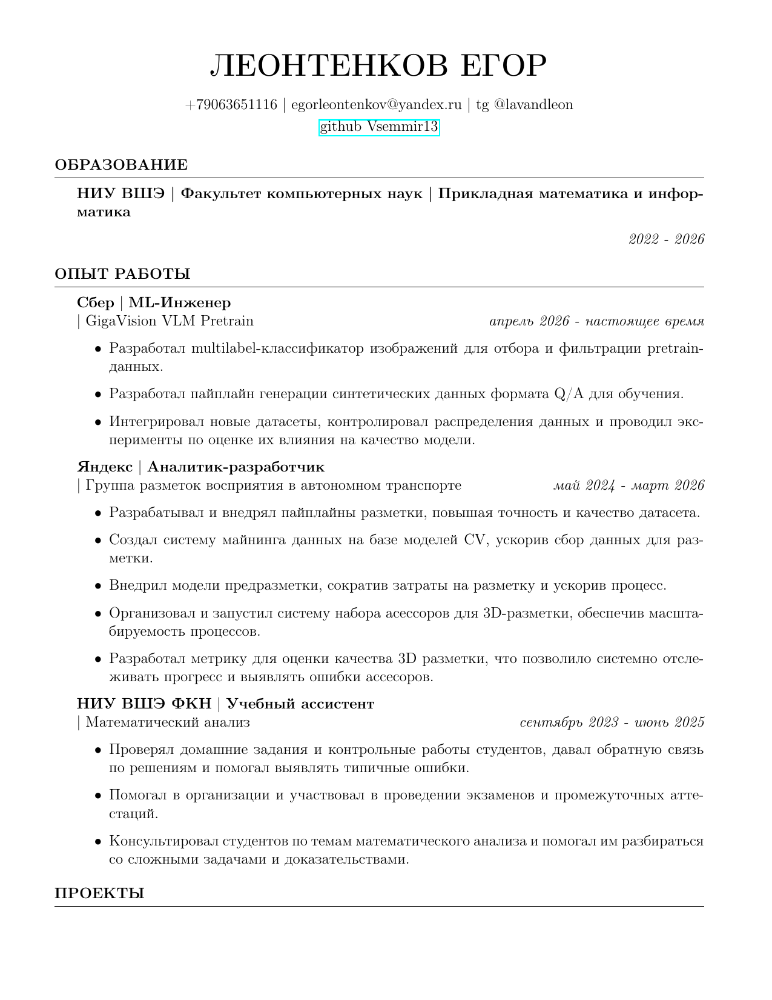

# Egor Leontenkov

### ML Engineer · Reinforcement Learning · LLM Post-Training

ML Engineer at Sber · HSE CS AMI '26 · Moscow

I work on machine learning research and deep learning systems. My professional
interests include reinforcement learning, LLM post-training, alignment, and
rigorous model evaluation.

## Skills & interests

| Area | Focus |
| --- | --- |
| **Reinforcement learning** | Policy gradients, actor-critic methods, PPO, offline RL, and preference-based learning. |
| **LLM post-training** | Supervised fine-tuning, preference optimization, reward modeling, RLHF/RLAIF, and behavioral evaluation. |
| **Training systems** | Mixed precision, profiling, DDP, FSDP, tensor/pipeline parallelism, checkpointing, and failure recovery. |
| **Evaluation** | Capability, robustness, uncertainty, safety, and distribution-shift evaluation. |
| **Research engineering** | Reproducible experiments, tested implementations, reusable infrastructure, and technical reporting. |

## Resume

[**Open or download the current CV (PDF, 2 pages)**](./assets/Egor_Leontenkov_CV.pdf)

Updated June 2026 · Russian

## Experience snapshot

- **ML Engineer, Sber — GigaVision VLM Pretrain** *(April 2026 - present)* 
  Multilabel image filtering for pretraining data, synthetic Q/A generation,
  dataset integration, distribution analysis, and quality experiments.
- **Analyst / Developer, Yandex — Autonomous Transport** *(May 2024 - March 2026)* 
  Data-mining and annotation pipelines, CV-assisted pre-annotation, quality
  metrics, and scalable 3D-annotation operations.
- **Teaching Assistant, HSE University — Mathematical Analysis** *(2023 - 2025)* 
  Assessment, feedback, consultations, and exam support.

## Selected evidence

| Project | Evidence relevant to the target profile |
| --- | --- |
| [Multilabel Image Classification](https://github.com/Vsemmir13/jmlc-multilabel-image-classification) | Reproducible PyTorch training, validation, ONNX export, and batch inference for a VLM data pipeline. |
| [G4 DNA Generation](https://github.com/Vsemmir13/g4-level-conditioned-generation) | Bachelor's thesis comparing discrete flow matching with LSTM and VAE baselines under biological evaluation. |
| [AMP Challenge 2026](https://github.com/Vsemmir13/amp-challenge-2026-ampdiffusion) | End-to-end generative pipeline: generation, deterministic refinement, filtering, learned reranking, and reproducibility artifacts. |
| [Latent Adversarial Diffusion Distillation](https://github.com/Vsemmir13/latent-adversarial-diffusion-distillation) | Paper implementation and generative-model evaluation with FID. |
| [RegRadar](https://github.com/Vsemmir13/regradar-hackathon) | Team-built evidence-first AI system with model adapters, evaluation, FastAPI, React, and deployment infrastructure. |

---

  Interested in reinforcement learning, LLM post-training, alignment, and evaluation.

